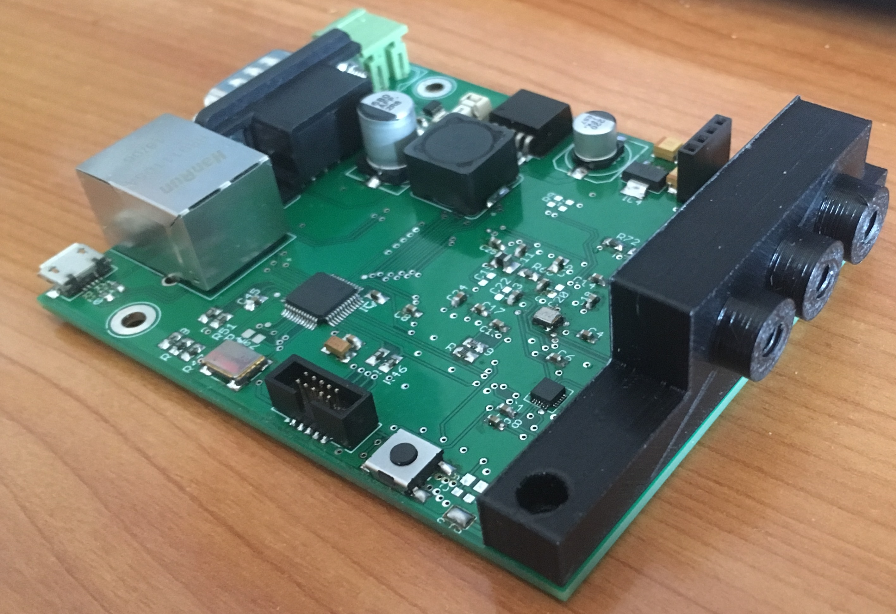
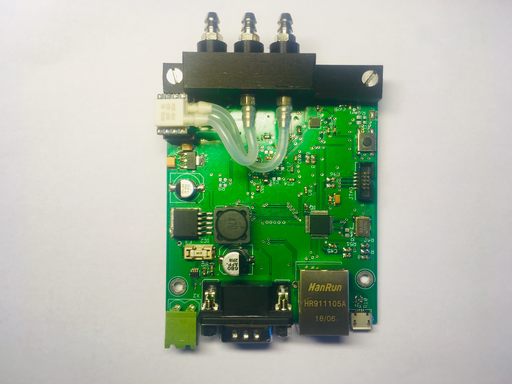
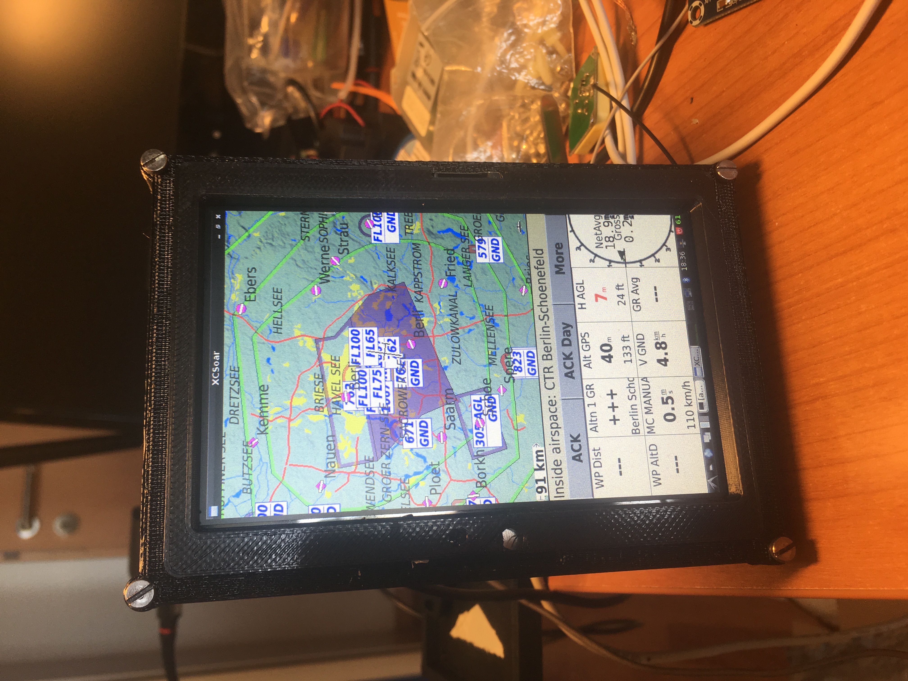
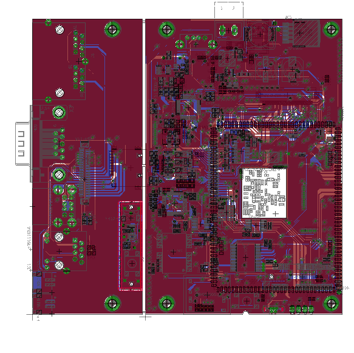

# Konzept

Als Grundlage dient das [Openvario](https://www.openvario.org/doku.php) Projekt. Dabei wurden eingie Sachen verbessert und optimiert. Das System sollte nur noch aus einer Platine bestehen, 
um so einen kleineren Formfaktor zu erziehlen. Bei dem Display hat sich die Größe
von 5 Zoll als optimal heraus gestellt, wodruch sich das Gerät auch in kleinen Instrumentenbrettern installieren lässt. 
Des Weiteren soll eine externe Sensorbox zum Einsatz kommen, die die Telemetriedaten im Flugzeug aufnimmt und entsprechend per CAN-Bus an die einzelnen Systeme verteilt. 
Die Bedienung des Geräte erfolgt erstmal weiterhin über den Openvario Stick. Dafür gibt es auch schon ein besseres Bedienkonzept, das aber noch nicht begonnen wurde.

# Sensorbox





# Navigationssystem
In der Abbildung ist der erste Prototyp erkennbar, auf dem auch schon XCSoar läuft. 


## Prozessor
Die Hardware soll natürlich auf der einen Seite leistungsstark sein, aber auch bezahlbar. 
Deswegen wurde für den ersten Prototyp das [SOM Einstein-S700](http://www.cubietech.com/product-detail/einstein-s700/) ausgewählt. 
Weitere Informationen findet ihr auf der Homepage von Cubietech.

## Platine

```
Kontakt:
```
